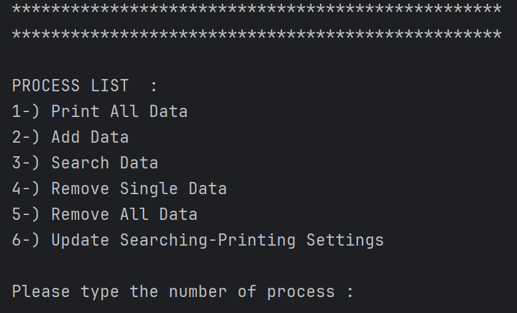
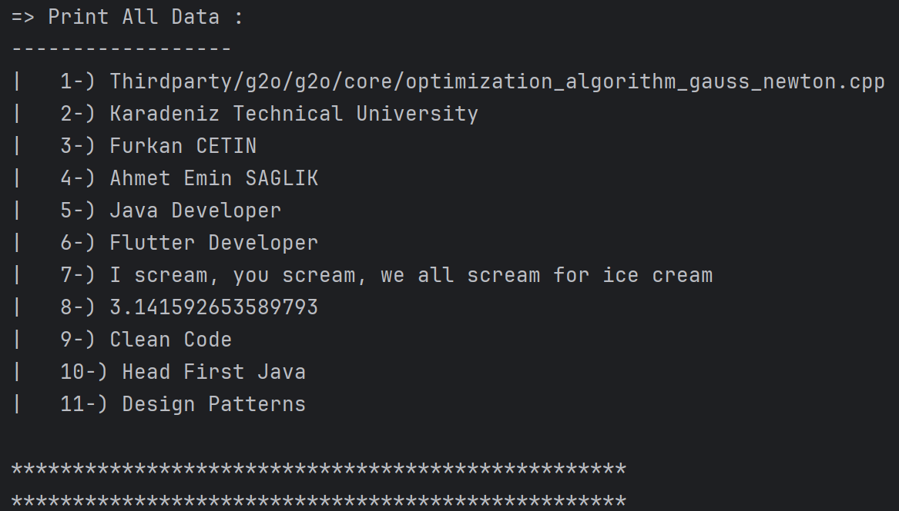
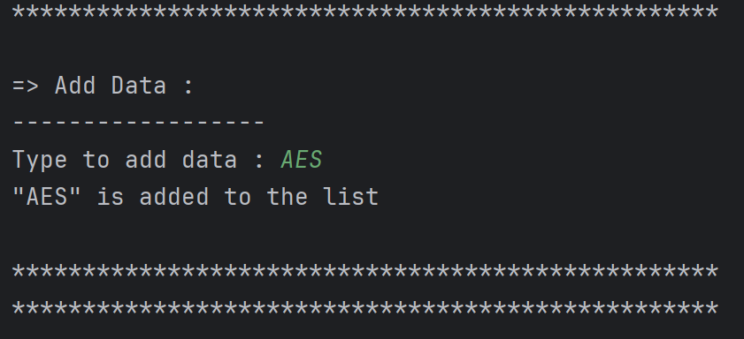
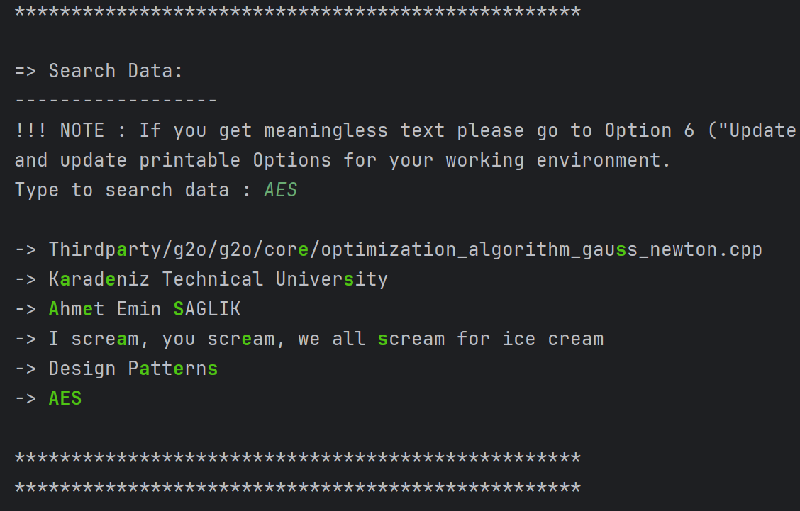
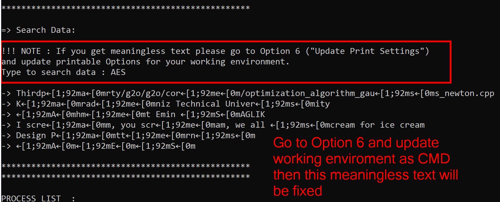
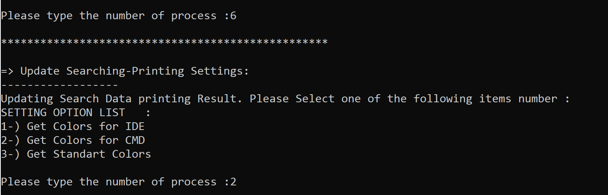
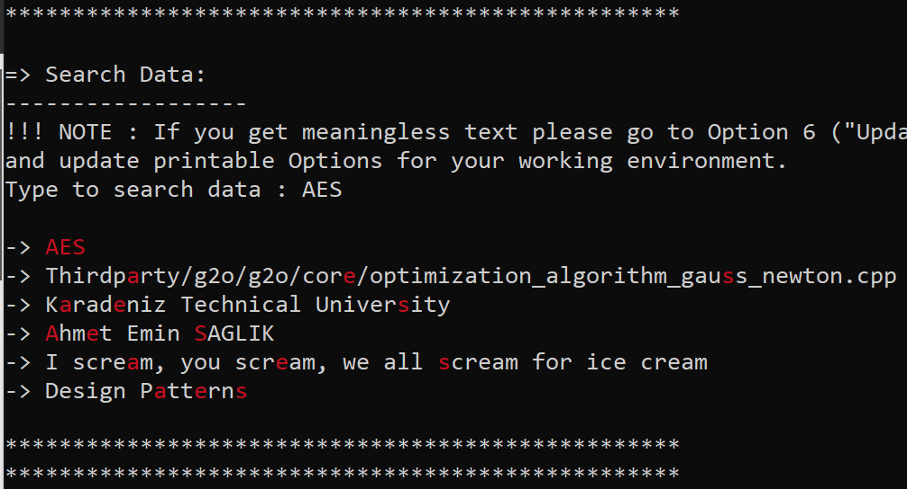
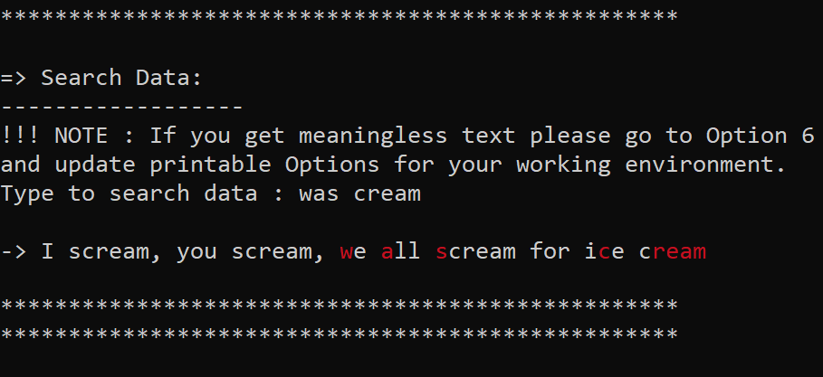
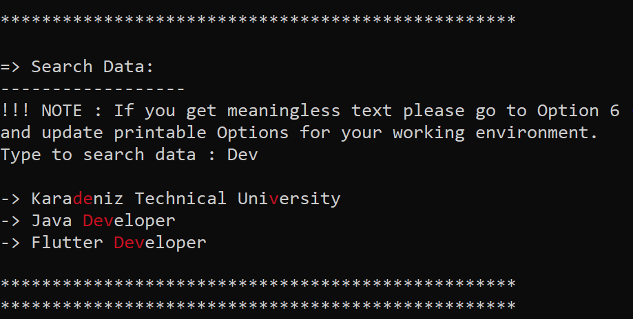

<h1><i>Github-Search-Bar </i> </h1>

<h2>Content</h2>
<ul>
        <li><a href="#about-project">1-) About The Project</a></li>
        <li><a href="#why-project-created">2-) Why The Project Is Created?</a></li>
        <li><a href="#used-technologies">3-) Used Technologies </a></li>
        <!-- <li><a href="#images">4-) Images </a></li> -->
        <li><a href="#images">4-) Images </a>
                <ul> 
                        <li><a href="#intelij-idea-output">I-) Intelij IDEA Output</a></li>
                        <li><a href="#windows-cmd-output">II-) Windows CMD Output</a></li>
                </ul>
        </li>
        <li><a href="#requirement">5-) Requirements</a></li>
         <li><a href="#quick-start">6-) Quick Start</a></li>
        <li><a href="#installation">7-) Installation</a></li>
        
</ul>

<h2 id="about-project">1-) About The Project</h2>
The project is a clone of the github search bar. The project search text in given list. If there is any matches text during the whole sentence then the sentences is printed.
<br>

<h2 id="why-project-created">2-) Why The Project Is Created?</h2>
The project was created to code an algorithm like github search bar.

<h2 id="used-technologies">3-) Used Technologies</h2>

  * JAVA SE
  

<h2 id="images">4-) Images </h2>

<h3 id="intelij-idea-output"><li> Intelij IDEA Output </li> </h3> 
<br>

</li> <br> <br>
</li> <br> <br>
</li> <br> <br>
</li> <br> <br>
</li> <br> <br>

<h3 id="windows-cmd-output"><li> Windows CMD Output </li> </h3> 
<br>

</li> <br> <br>
</li> <br> <br>
</li> <br> <br>
</li> <br> <br>
</li> <br> <br>


<h2 id="requirement">5-) Requirements</h2>

* <a href="https://www.oracle.com/tr/java/technologies/javase/jdk11-archive-downloads.html">JDK 11</a>
* <a href="https://www.jetbrains.com/idea/download/?section=windows"> Intelij IDEA (Community Edition) </a></li> 

<h2 id="quick-start">6-) Quick Start</h2>
1-) Copy and paste the following command in your cmd.
<br><br>

```
git clone https://github.com/AhmetEminSaglik/Github-Search-Bar.git
```
2-) Then copy and paste the following command in your cmd.
```
java -jar Github-Search-Bar/Github-Search-Bar.jar
```

<h2 id="installation">7-) Installation </h2>
1-) Copy and paste the following command in your cmd.
<br><br>

```
git clone https://github.com/AhmetEminSaglik/Github-Search-Bar.git
```
2-) Open IDE, and open the cloned project.

3-) The project is ready to run.
